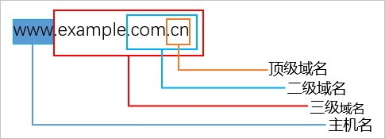

# 1. 概述

Web应用的渗透测试流程主要分为3个阶段，分别是：信息收集→漏洞发现→漏洞利用

**渗透的本质也就是信息收集**，信息收集是指通过各种渠道或方式获取目标相关的信息，以便后续步骤。

目标网站信息收集的分类：

- 域名信息收集

- 站点信息收集

- 敏感信息收集

- 服务器信息收集

  


# 2. 域名信息收集

概念：域名的出现是为了解决IP地址不方便人们记忆，并且不能显示地址组织的名称和性质等特点。

示例：`www.baidu.com `和 `14.215.177.38 `哪一个更加容易记忆

## 2.1 关于域名的基本概念

一个完整的域名至少有两个部分，各部分之间用`.`来分隔，最后一个`.`的右边部分称为顶级域名，也称为一级域名；最后一个`.`的左边部分称为二级域名；二级域名的左边部分称为三级域名



- 顶级域名（一级域名）

  顶级域名是域名的最后一个部分，即是域名最后一点之后的字母。

  例如在www.baidu.com这个域名中，顶级域是.com

- 二级域名

  二级域名就最靠近顶级域名左侧的字段，在上述案例中baidu就是二级域名

- 子域名

  示例：`mail.example.com`和`calendar.example.com`是` example.com`的两个子域，而`example.com`则是顶级域.com的子域。

  > 收集的子域名越多，我们测试的目标就越多，渗透的成功率也越大

凡顶级域名前加前缀的都是该顶级域名的子域名，而子域名根据技术的多少分为二级子域名，三级子域名以及多级子域名。

## 2.2 根据域名你能得到那些信息

1. WHOIS查询

   > WHOIS是用来查询互联网中域名的IP以及所有者等信息的传输协议。
   >
   > WHOIS通常使用TCP协议43端口。每个域名或IP的WHOIS信息由对应的管理机构保存，例如，以.com结尾的域名的WHOIS信息由.com域名运营商VeriSign管理，中国国家顶级域名.cn域名由CNNIC管理。
   >
   > 通常情况下，域名或IP的信息可以由公众自由查询获得，具体的查询方法是登录由管理机构提供的WHOIS服务器，输入待查询的域名进行查询。

   **通过WHOIS你可以得到：注册商、注册人、邮件、DNS解析服务器、注册人联系电话。**

2. 企业的备案信息：

   网站备案信息是根据国家法律法规规定，由网站所有者向国家有关部门申请的备案，是国家信息产业部对网站的一种管理途径，是为了防止在网上从事非法网站经营活动，

   > 国外并没有备案信息，所以这些仅针对国内网站

   常用的备案信息查询网站有以下几个：

   - 天眼查：https://www.tianyancha.com/ 
   - ICP备案查询网：http://www.beianbeian.com/ 
   - 国家企业信用信息公示系统：http://www.gsxt.gov.cn/index.html 

   **通过企业备案信息你可以得到单位信息，例如名称、备案编号、网站负责人、法人、电子邮箱、联系电话**

3. 子域名信息收集

   - 更多的子域名将帮助你发现更多的漏洞。

   - 有些隐藏的或者被忽略的子域名上运行的应用程序可能帮助我们发现重大漏洞

   - 同一组织的不同域名往往存在相同漏洞

   示例：

   > 假设我们需要测试的网站规模很大，直接从这个主域名入手比较难，因为对于这种级别的站点来说，主域名是其重点保护对象。所以可以先进入目标的子域名，然后通过子域名测试真正的目标

   收集子域名的方法：

   - Google语法`site:baidu.com`

   - 第三方工具

     - DNSdumpster：https://dnsdumpster.com/
     - whois反查：http://whois.chinaz.com/
     - virustotal：[www.virustotal.com](http://www.virustotal.com/)
     - 子域名爆破：[https://phpinfo.me/domain/](https://phpinfo.me/domain)
     - IP反查绑定域名：http://dns.aizhan.com/
     - https://hackertarget.com/find-dns-host-records/
     - https://site.ip138.com

   - 基于SSL证书查询

     证书透明度是证书授权机构的一个项目，证书授权机构会将每个SSL/TLS证书发布到公共日志中。一个SSL/TLS证书通常包含域名、子域名和邮件地址，这些也经常成为攻击者非常希望获得的有用信息。

     查找一个域名证书的最简单方法是使用搜索引擎来收集计算机的CT日志，并让任何搜索引擎搜索它们。前两种比较常用。

     - https://crt.sh/
     - https://censys.io/
     - https://developers.facebook.com/tools/ct/
     - https://google.com/transparencyreport/https/ct/

   - 爆破枚举

     这个就有很多工具可以用了，大佬们都有自己用的顺手的工具，比较常见的是：

     - layer子域名挖掘机
     - subDomainsBrute
     - K8
     - orangescan
     - DNSRecon

     > github也可以搜索子域名，可以试试

# 3. 站点信息收集

站点信息即网站站点信息，主要有如下几点：

- CMS指纹识别

  CMS（内容管理系统）又称为整站系统或文章系统，用于网站内容管理。识别出相应的CMS，才能查找与其相关的漏洞，然后就可以直接使用进行渗透测试。

  > 常见的CMS有Dedecms(织梦)、Discuz、PHPWEB、PHPWind、PHPCMS、ECShop、Dvbbs、SiteWeaver、ASPCMS、帝国、Z-Blog、WordPress等

  1. 在线识别

     - BugScaner: http://whatweb.bugscaner.com/look/
     - 潮汐指纹：http://finger.tidesec.net/
     - 云悉：http://www.yunsee.cn/info.html
     - WhatWeb: https://whatweb.net/
     - 云悉指纹: http://www.yunsee.cn/finger.html

  2. 利用工具

     常见的CMS指纹识别工具有WhatWeb、WebRobo、椰树、御剑Web指纹识别。大禹CMS识别程序等，可以快速识别一些主流CMS。

  3. 手工识别

     - 根据HTTP响应头判断，重点关注X-Powered-By、cookie等字段
     - 根据HTML 特征，重点关注 body、title、meta等标签的内容和属性。
     - 根据特殊的class判断。HTML 中存在特定 class 属性的某些 div 标签，如`<body class="ke-content">`

- 敏感目录/文件

  通常我们所说的敏感文件、敏感目录大概有以下几种：

  - Git
  - hg/Mercurial
  - svn/Subversion
  - bzr/Bazaar
  - Cvs
  - WEB-INF泄露
  - 备份文件泄露、配置文件泄露

  > 敏感文件、敏感目录挖掘一般都是靠工具、脚本
  >
  > （1）御剑（万能）
  >
  > （2）爬虫（AWVS、Burpsuite等）
  >
  > （3）搜索引擎（Google、Github等）
  >
  > （4）wwwscan
  >
  > （5）BBscan（https://github.com/lijiejie/BBScan ）
  >
  > （6）GSIL（https://github.com/FeeiCN/GSIL ）

- Waf识别

  Waf也叫Web应用防火墙，是通过执行一系列针对HTTP/HTTPS的安全策略来专门为Web应用提供保护的一款产品。

  waf工作原理：

  - 发送正常的HTTP请求，然后分析响应，这可以识别出很多WAF。
  - 如果不成功，它会发送一些（可能是恶意的）HTTP请求，使用简单的逻辑推断是哪一个WAF。
  - 如果这也不成功，它会分析之前返回的响应，使用其它简单的算法猜测是否有某个WAF或者安全解决方案响应了我们的攻击。

  推荐工具：https://github.com/EnableSecurity/wafw00f

# 4. 敏感信息收集

某些情况下，我们需要测试的目标在安全防护上做的较好，无法通过常规技术手段完成渗透测试。

此时，便可以利用搜索引擎搜索目标暴露在互联网上的关联信息

> 例如：数据库文件、SQL注入、服务配置信息，甚至是通过Git找到站点泄露源代码，以及Redis等未授权访问、Robots.txt等敏感信息，从而达到渗透目的。

通过谷歌查询目标网站的敏感信息，配合谷歌搜索引擎的一些语法：

```
intext：寻找正文中含有关键字的网页
intitle：寻找标题中含有关键字的网页
allintitle：用法和intitle类似，只不过可以指定多个词
inurl：搜索url中含有关键词的网页
allinurl：用法和inurl类似，只不过可以指定多个词
site：指定访问的站点
filetype：指定访问的文件类型
link：指定链接的网页
related：搜索相似类型的网页
info：返回站点的指定信息，例如：info:www.baidu.com   将返回百度的一些信息
phonebook：电话簿查询美国街道地址和电话号码信息
Index of：利用 Index of 语法可以发现允许目录浏览的web网站，就像在本地的普通目录一样
```

示例：

```
intext:后台登录：将只返回正文中包含“后台登录”的网页
intitle:后台登录：将只返回标题中包含“后台登录”的网页
inurl:admin/login.php 查找管理员登录页面
inurl:/phpmyadmin/index.php 查找后台数据库管理页面
查找指定网站后台
	site:xx.com intext:管
	site:xx.com inurl:login
	site:xx.com intitle:后台
查看指定网站的文件上传漏洞
	site:xx.com inurl:file
	site:xx.com inurl:load
查看指定网站的文件上传漏洞
    site:xx.com inurl:file
    site:xx.com inurl:load
利用Index of可以发现允许目录浏览的web网站，就像在本地的普通目录一样
    index of /admin
    index of /passwd
    index of /password
    index of /mail
    "index of /" +passwd
    "index of /" +password.txt
    "index of /config"
备份文件泄露
    intitle:index.of index.php.bak
    inurl:index.php.bak
    intitle:index.of www.zip
查找sql注入
    inurl:?id=1
    inurl: php?id=
github源码泄漏（参考：https://blog.csdn.net/qq_45521281/article/details/105767428）
    site:Github.com smtp
```

# 5. 服务器信息收集

服务器信息收集主要包括以下内容

- Web服务器指纹识别

  Web服务器指纹识别是了解正在运行的web服务器类型和版本，包括但不限于以下内容：

  ```
  1、Web服务器名称，版本（centos，ubuntu）
  2、Web服务器后端是否有应用服务器
  3、数据库(DBMS)是否部署在同一主机(host)，数据库类型
  4、Web应用使用的编程语言
  5、Web应用框架
  ```

  示例：

  - 手工检测

    查看HTTP响应头中的Server、X-Powered-By、Cookie 等字段，

    ```shell
    > curl -I https://blog.csdn.net/
    
    HTTP/1.1 200 OK
    Server: openresty
    ....
    ```

  - 工具识别

    whatweb 是一款用于辅助的自动化Web应用指纹分析工具，它能够识别各种关于网站的详细信息包括：CMS类型、博客平台、中间件、web框架模块、网站服务器、脚本类型、JavaScript库、IP、cookie等等。

- 真实IP地址识别

  真实IP指根据域名来确定目标服务器的真实IP，但是**如果目标服务器使用了CDN那么可能会获取到节点IP而非真实IP**

  > **CDN是什么？**
  >
  > CDN，即内容分发网络。它会使用户就近获取所需内容，降低网络拥塞，提高用户访问响应速度和命中率。
  >
  > CDN将用户经常访问的静态数据资源直接缓存到节点服务器上，当用户再次请求时，就近发送节点服务器上的数据，只有发生实际数据交互时才会从远程服务器上获取响应内容。

  > **如何判断用户使用CDN？**
  >
  > - 通过PING 命令可以简单判断：
  >
  >   ```
  >   >ping www.baidu.com
  >   
  >   正在 Ping www.a.shifen.com [14.215.177.38] 具有 32 字节的数据:
  >   来自 14.215.177.38 的回复: 字节=32 时间=36ms TTL=55
  >   来自 14.215.177.38 的回复: 字节=32 时间=36ms TTL=55
  >   来自 14.215.177.38 的回复: 字节=32 时间=35ms TTL=55
  >   ```
  >
  > - 通过一些在线网站，在不同地区进行ping测试，如果出现的ip地址是一样的，则表示目标并未使用CDN技术，如果不一致则表示使用了CDN
  >
  >   - [http://ping.chinaz.com/](http://ping.chinaz.com/)
  >   - [https://www.wepcc.com](https://www.wepcc.com/)
  >   - [https://www.17ce.com](https://www.17ce.com)

  **如何绕过CDN找到目标真实IP？**

  1. 利用子域名

     一般来说很多站长可能只会对主站或者流量较大的分站使用CDN，但是一些流量比较小的分站可能没有挂CDN，这些分站和主站虽然不是同一个IP但是都在同一个C段下面的情况，所以我们可以通过ping二级域名获取分站lP，从而能判断出目标的真实IP段。

  2. 查询主域

     去掉www然后再去ping

     ```
     >ping baidu.com
     
     正在 Ping baidu.com [220.181.38.251] 具有 32 字节的数据:
     来自 220.181.38.251 的回复: 字节=32 时间=28ms TTL=53
     来自 220.181.38.251 的回复: 字节=32 时间=25ms TTL=53
     ```

  3. 敏感文件

     扫描网站敏感文件，从而找到真实IP

  4. 国外访问

     国内很多CDN厂商因为各种原因只做了国内的线路，而针对国外的线路可能几乎没有，此时我们使用国外的主机直接访问可能就能获取到真实IP

     - [https://asm.ca.com/en/ping.php](https://asm.ca.com/en/ping.php)

  5. 通过邮件服务器

     一般的邮件系统都在内部，没有经过CDN的解析，通过目标网站用户注册或者RSS订阅功能，查看邮件，寻找邮件头中的邮件服务器域名IP，ping这个邮件服务器的域名，由于这个邮件服务器的有可能跟目标Web在一个段上，我们直接一个一个扫，看返回的HTML源代码是否跟web的对的上，就可以获得目标的真实IP(必须是目标自己内部的邮件服务器，第三方或者公共邮件服务器是没有用的)。

  6. 历史CDN解析记录

     也许目标很久之前没有使用CDN，所以可能会存在使用 CDN 前的记录。所以可以通过[https://www.netcraft.com](https://www.netcraft.com/)、https://viewdns.info/等网站来观察域名的IP历史记录。

  7. Nslookup查询。

     查询域名的NS记录、MX记录、TXT记录等很有可能指向的是真实ip或同C段服务器。

  8. 利用网络空间搜索引擎

     利用网站返回的内容寻找真实原始IP，如果原始服务器IP也返回了网站的内容，那么可以在网上搜索大量的相关数据。最常见的网络空间搜索引擎有如下：

     - Shodan：https://www.shodan.io/
     - 钟馗之眼：https://www.zoomeye.org/
     - FOFA：https://fofa.so/

  9. 让目标主动连接我们

     - 发邮件给我们。比如订阅、注册的时候会有注册连接发送到我们的邮件，然后查看邮件全文源代码或邮件标头，寻找邮件头中的邮件服务器域名IP就可以了。
     - 利用网站漏洞。比如有代码执行漏洞、SSRF、存储型的XSS都可以让服务器主动访问我们预设的web服务器，那么就能在日志里面看见目标网站服务器的真实IP。

  **验证是否是真实IP**

  直接尝试使用IP访问即可，看看响应的页面是不是和访问域名返回的一样即可

  比如访问百度：

  - 先尝试访问百度的CDN节点IP：14.215.177.38可以发现域名未发生变化
  - 在访问百度真实IP220.181.38.251，可以发现域名已经变成了baidu.com

- 端口信息收集

  收集端口信息也是十分重要的事情，通过扫描目标服务器开放的端口可以从该端口判断服务器上运行的服务，因为针对不同的端口具有不同的攻击方法，收集端口信息可以对症下药，便于我们渗透目标服务器

  > 如果目标开放了6379端口我们可以判断目标极有可能使用了redis，然后就可以测试redis相关漏洞

  方法：

  - 使用nmap工具收集

    ```shell
    nmap -A -v -T4 -O -sV 目标地址
    ```

  - 使用masscan探测端口开放信息

    masscan的扫描结果类似于nmap，但它更快

  需要注意的是，使用这些工具通常会在目标网站上留下痕迹，所以可以通过在线网站探测：

  - 在线网站：http://tool.chinaz.com/port/
  - ThreatScan在线网站（网站基础信息收集）：https://scan.top15.cn/
  - Shodan：https://www.shodan.io/

  常见端口可参考：https://blog.csdn.net/weixin_42320142/article/details/102679143

- 旁站，C段

  旁站：是和目标网站在同一台服务器上的其它的网站。

  C段：是和目标服务器ip处在同一个C段的其它服务器。

  通过一些在线网站就可以查询：

  - 利用Bing.com，语法为：http://cn.bing.com/search?q=ip:111.111.111.111 
  - 站长之家：http://s.tool.chinaz.com/same 
  - 利用Google，语法：site:125.125.125.*
  - 利用Nmap，语法：nmap  -p  80,8080  --open  ip/24
  - K8工具、御剑、北极熊扫描器等
  - 在线：http://www.webscan.cc/ 

